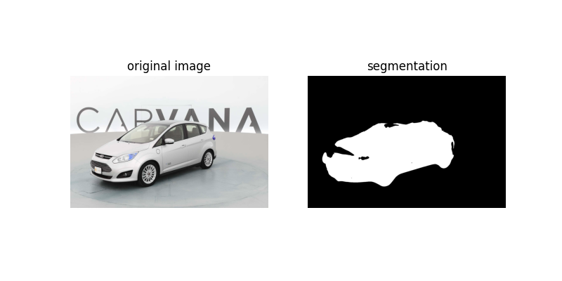
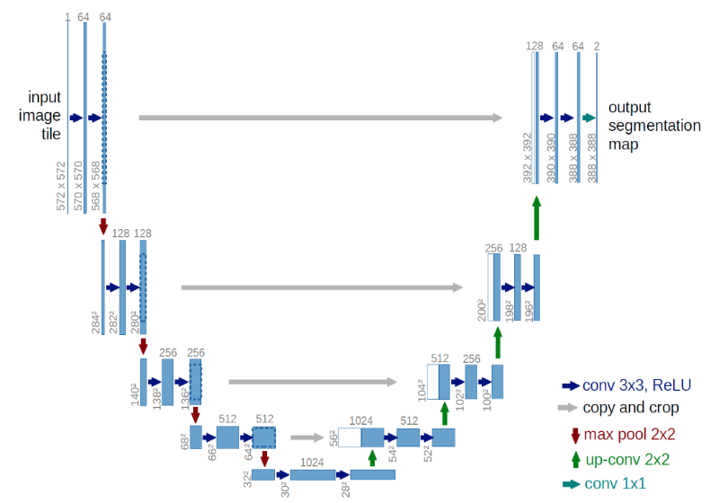

# UNet-Image-Segmentation
# Abstract
In this project, i implement the task of image segmentation using Unet model. There are only 2 classes: car and background, so the task is to 
segment pixels representing car inside a single image. 

# Installation
- torch==1.6.0
- torchvision==0.7.0
- Pillow==8.0.1
- tqdm 
- tensorboard

# Prepare data
Data can be downloaded from this link: https://www.kaggle.com/c/carvana-image-masking-challenge/data

Because the whole dataset is too big, so i only uploaded a subset of whole dataset into this project, and it is stored in folder "data". 
Inside folder "data/train", there are two subfolders "imgs" and "masks", the folder "masks" contains masks corresponding to images in the folder "imgs". 

# Visualization 

# Model architecture
Original paper can be found at : https://arxiv.org/abs/1505.04597

# Train 
Run command : "python train.py --epochs 20"

After training completed, the weight would be saved into folder "checkpoints". 

# Test 
Run command of the format "python predict.py --model model_path --input img_path --output output_img_path" .
For example: "python predict.py --model checkpoints/CP_epoch5.pth --input data/test/6a951d3a3131_03.jpg --output predicted_imgs/6a951d3a3131_03.jpg" . 

